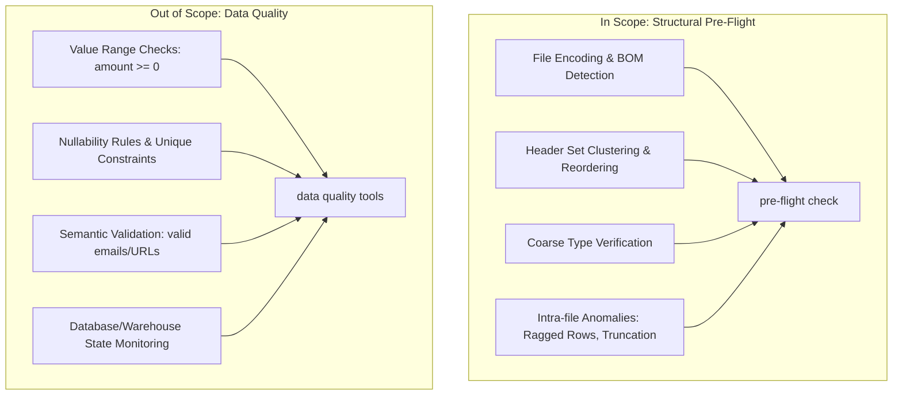

# willitload — Fileset Structural Pre-Flight for Bulk Loads

[](https://github.com/ramwise-io/willitload-engine/actions)
[](https://opensource.org/licenses/Apache-2.0)
[](https://www.python.org/downloads/)

`willitload` is a stateless, deterministic, local-first engine designed to validate bulk filesets before your loader attempts to ingest them. It finds the single structurally broken file that would fail your bulk load, allowing you to quarantine it *before* wasting hours of pipeline compute.

👉 **[View Sample Scan & Check Reports](docs/sample_reports.md)** showing real-world anomalies, terminal screens, and JSON outputs.

---

## 📖 The War Story: The Silent Column Shift

It's 3:00 AM. A critical data pipeline ingests thousands of CSV files daily into a cloud data warehouse using a scheduled Spark job. Tonight, one file out of 4,000—generated by a single legacy CRM instance—was produced with a minor anomaly: a user entered a comment containing an unescaped comma: `note with, comma`.

Because the CRM exporter didn't escape it or wrap the field in quotes, this single line was split into six columns instead of five. 

The loader didn't crash immediately. Instead, depending on the ingestion mode:
- **In Position Mode:** The loader offset all columns to the right, shifting the text comment into the numeric `amount` column, causing a silent type-coercion that turned every subsequent numeric value into `NULL` or corrupt data.
- **In Name Mode:** The schema parser threw an unhelpful runtime exception 45 minutes into the load, aborting the write operation and leaving the target table in a partially written, inconsistent state that took hours of database restore time to fix.

If `willitload` had been run as a pre-flight check in the workflow, it would have scanned all 4,000 files in under 3 seconds, pinpointed `orders_crm_legacy_087.csv` as having a `RAGGED_ROWS` anomaly at `row 1092`, and quarantined it before the database loader ever started.

---

## 🛠️ Conformance Comparison (Golden vs. Broken)

Here is a visual demonstration of what `willitload` checks when comparing files against a baseline contract:

### Golden (Conforms)
A fileset where every file matches the baseline contract structurally.

```
Expected Contract (baseline.schema):
customer_id,int
order_date,date
amount,decimal
status,text
notes,text

Discovered Fileset Structure:
orders_001.csv -> [customer_id: int, order_date: date, amount: decimal, status: text, notes: text] (Conforms)
orders_002.csv -> [customer_id: int, order_date: date, amount: decimal, status: text, notes: text] (Conforms)
orders_003.csv -> [customer_id: int, order_date: date, amount: decimal, status: text, notes: text] (Conforms)
```

### Broken (Does Not Conform)
A fileset containing structural drift or anomalies. `willitload` highlights the exact files and fields that fail.

```
Discovered Fileset Structure:
orders_001.csv   -> [customer_id: int, order_date: date, amount: decimal, status: text, notes: text] (Conforms)
orders_extra.csv -> [..., notes: text, region: text]          -> EXTRA_COLUMN error (region is not declared)
orders_typed.csv -> [customer_id: text, ...]                  -> TYPE_MISMATCH error (customer_id is text, expected int)
orders_split.csv -> [..., notes: text]                        -> RAGGED_ROWS error (Row 12 has 6 columns instead of 5)
```

---

## 🎯 Boundary Articulation

To maintain absolute reliability and speed, `willitload` enforces a strict architectural boundary between **structure** and **quality**:



### In Scope
- **Formats Supported:** CSV, TSV, Parquet, JSON, JSONL, SQLite, XML, and Excel (`.xlsx`).
- **Baselines Supported:** Flat Schema files (`name,type`), Prior Scan JSON, Golden Sample files, and SQL DDL scripts (`CREATE TABLE`).
- **Acquisition Facts:** Verification of read access, BOM encoding, and compression status.
- **Physical Layout:** Delimiter detection, quoting convention, newlines, and truncation.
- **Structural Identity:** Column count, order, and canonicalized name matching.
- **Coarse Types:** Resolution of columns into basic classes (`int`, `decimal`, `bool`, `date`, `timestamp`, `text`, `blob`).

### Out of Scope
- **Value Checking:** Validating ranges, formats, regex patterns, or uniqueness constraints.
- **Business Rules:** Custom business logic or constraints (e.g., `amount > 0`).
- **Live State:** Connecting directly to database tables or storing history. We are stateless.

---

## ⚡ Quickstart

### 1. Installation

Install the package directly from GitHub:
```bash
pip install git+https://github.com/ramwise-io/willitload-engine.git
```

Or install it locally for development:
```bash
pip install -e .
```

### 2. Command Line Interface

#### Scan a directory to discover structural families and anomalies:
```bash
willitload scan ./data/
```

#### Check a directory against a schema contract (flat schema or SQL DDL):
```bash
willitload check ./data/ --against ./baseline.schema --align name
# Or using a SQL DDL CREATE TABLE statement:
willitload check ./data/ --against ./schema.sql --align name
```

### 3. Programmatic Python API

Integrate `willitload` directly into your ETL or pipeline code:

```python
from willitload.core import scan, check
from willitload.baseline import parse_flat_schema
from willitload.models import AlignmentMode, ExtraColumnPolicy

# 1. Scan a folder to inspect structure programmatically
scan_result = scan("./raw_data/*.csv")
print(f"Profiled {scan_result.accounting.profiled} files.")

# 2. Check conformance before triggering a warehouse load
baseline = parse_flat_schema("./baseline.schema")
check_result = check(
    path_expr="./raw_data/*.csv",
    baseline=baseline,
    mode=AlignmentMode.NAME,
    extra_policy=ExtraColumnPolicy.STRICT
)

if check_result.has_errors:
    print(f"Aborting load: {len(check_result.broken)} files do not conform!")
    for v in check_result.broken:
        print(f"  Broken file: {v.path}")
        for finding in v.findings:
            print(f"    - {finding.locus}: {finding.explanation}")
else:
    print("All files conform. Executing bulk load...")
```

---

## 🧪 Running Tests & Benchmark

### Run unit and integration tests:
```bash
python -m pytest -v
```

### Run performance benchmark (1,000 files in < 5 seconds):
```bash
python tests/benchmark_perf.py
```
